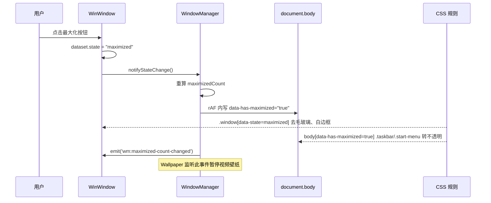

## 用户需求

在空目录 `g:/WindowsNext` 中，用纯 HTML + JavaScript（原生 ES Modules，无构建步骤）实现一个模拟 Windows 11 桌面环境的 Web 应用，具备完整的桌面外壳、窗口管理器、8 个内置示例应用，并对外提供可扩展的 JavaScript 编程接口以便后续注册新应用。

## 产品概述

一个在浏览器中运行的「类 Windows 11 桌面操作系统」。打开页面后呈现一整块桌面：可自定义的动态壁纸、网格排列的桌面图标、底部居中对齐的任务栏与开始菜单。双击图标以窗口形式启动应用，窗口可拖拽、缩放、最小化、最大化、贴边分屏、层叠管理。整体视觉为 Windows 11 Fluent 风格叠加 Aero 毛玻璃质感。

## 核心功能

### 桌面外壳

- **桌面图标**：网格自动布局，支持单击选中、框选多选、双击启动、拖拽换位、图标位置持久化。
- **任务栏**：底部居中图标区（Win11 风格），左侧「开始」按钮，右侧系统托盘（时间日期、音量、网络、通知）。同一应用的多个窗口自动堆叠为单个图标并显示层叠指示条；悬停弹出窗口缩略图预览列表，点击缩略图快速切换/最小化恢复窗口；支持应用固定到任务栏。
- **开始菜单**：Win11 风格弹出面板，含搜索框、「已固定」应用宫格、「推荐的项目」最近文件列表、底部用户区与电源按钮。
- **右键菜单**：Win11 圆角上下文菜单，桌面空白处（查看/排序/刷新/个性化/新建）、桌面图标、任务栏图标（跳转列表/关闭窗口/固定）、窗口标题栏（系统菜单）各有对应菜单，支持子菜单与图标。

### 窗口管理器

- 拖拽移动、八向缩放、最小化/最大化/还原/关闭、双击标题栏最大化、Snap 贴边分屏（左右半屏、四角）、z-order 焦点管理、最小化到任务栏的动画。
- **Aero 联动规则一（窗口级）**：窗口处于普通窗口化状态时，边框与标题栏呈 Aero 半透明毛玻璃；一旦最大化，毛玻璃消失变为不透明白色边框；还原后毛玻璃恢复。
- **Aero 联动规则二（全局级）**：桌面上只要存在任意一个最大化窗口，任务栏与开始菜单立即取消半透明变为不透明；当不存在任何最大化窗口时，二者恢复 Aero 毛玻璃。

### 壁纸系统

支持三种壁纸模式并可实时切换：静态图片（含填充方式选择）、MP4 视频动态壁纸（提供静音/取消静音切换、循环播放、失焦暂停省电）、HTML 页面作为壁纸（以隔离容器承载交互式动态背景）。

### 文件系统

内置虚拟文件系统作为 C: 盘（Desktop / Documents / Pictures / Music / Videos / Downloads 等标准目录），数据持久化到浏览器本地存储；同时支持挂载真实本地文件夹作为额外驱动器，两者通过统一接口对上层应用透明。

### 内置应用（8 个）

- **文件资源管理器**：多标签页、地址栏面包屑、左侧导航树、大图标/列表/详细信息视图切换、新建/重命名/删除/复制粘贴、搜索、文件拖放上传。
- **计算器**：标准/科学模式，数学表达式解析求值，历史记录；函数绘图模式使用 ECharts 绘制 y=f(x) 曲线，支持多函数叠加、缩放平移、定义域设置。
- **终端**：模拟 Linux bash，支持 ls / cd / pwd / cat / echo / mkdir / touch / rm / mv / cp / clear / help / neofetch 等命令操作虚拟文件系统，含命令历史、Tab 补全、管道式输出渲染。
- **浏览器**：多标签页、地址栏、前进后退刷新、书签栏，以 iframe 承载页面，对不可嵌入站点给出友好提示并提供新窗口打开入口。
- **媒体播放器**：模仿 Windows 10 Media Player 外观，支持音频与视频播放、播放列表、进度条、音量、播放模式、全屏、音频可视化频谱。
- **记事本**：文本编辑、打开/保存到文件系统、自动换行、查找替换、字数统计、状态栏。
- **任务管理器**：进程（运行中应用）列表、CPU/内存模拟占用曲线、结束任务、启动应用统计。
- **设置**：个性化（壁纸模式、主题色、亮暗模式、Aero 强度）、系统（分辨率缩放、通知）、应用管理、关于页。

### 可扩展编程接口

对外暴露全局 SDK，允许通过声明式配置注册新应用（图标、名称、默认窗口尺寸、启动入口、支持的文件类型关联），并提供窗口、通知、文件系统、对话框、设置读写等 API 供第三方应用调用，附带完整开发文档与一个示例第三方应用。

## 技术栈选型

| 层面 | 选型 | 说明 |
| --- | --- | --- |
| 语言 | 原生 JavaScript (ES2020+) | 使用原生 ES Modules，`<script type="module">` 加载，零构建 |
| 结构 | HTML5 单页 | 单个 `index.html` 作为宿主，全部 UI 由 JS 动态构建 |
| 样式 | 原生 CSS + CSS 自定义属性 | 按模块拆分 CSS 文件，通过 `<link>` 引入；CSS 变量驱动主题与 Aero 状态 |
| 毛玻璃 | `backdrop-filter: blur() saturate()` | 配合 CSS 变量与 `data-*` 属性做状态切换 |
| 图表 | ECharts 5 (CDN) | 计算器函数绘图、任务管理器性能曲线 |
| 表达式解析 | 自研 Shunting-Yard 解析器 | 不依赖 mathjs，避免大体积 CDN，完全可控且支持自定义函数 |
| 图标 | 内联 SVG 图标集 | 自绘 Fluent 风格 SVG，避免外部字体依赖与 FOUC |
| 持久化 | IndexedDB（主）+ localStorage（配置） | 文件二进制内容存 IndexedDB，桌面/窗口/设置等轻量状态存 localStorage |
| 真实文件 | File System Access API | 挂载本地目录作为额外驱动器，特性检测降级 |


**不引入**：npm / package.json / Vite / webpack / TypeScript / 任何框架。仅需一个静态服务器（ES Modules 的 CORS 限制要求 http 协议，`file://` 下模块加载会失败，需在 README 说明用 `python -m http.server` 或 VSCode Live Server 启动）。

## 实现思路

### 总体策略

采用**微内核 + 应用插件**架构。内核（kernel）只负责窗口管理、进程管理、事件总线、文件系统、设置存储、通知等基础服务；所有可见的桌面 UI（桌面、任务栏、开始菜单、右键菜单、壁纸）作为 shell 层订阅内核状态渲染；8 个内置应用与用户后续新增的应用一视同仁，全部通过同一套 `WinNext.registerApp()` SDK 注册。这样保证「内置应用能做到的，第三方应用也能做到」，是可扩展性的根本保证。

### 关键技术决策

**1. Aero 状态联动 —— 单一数据源 + CSS 属性选择器驱动**

这是用户强调的三条硬性 UI 规则，必须有确定性机制，不能靠各处手动 `classList.toggle` 拼凑。方案：

- `WindowManager` 内部维护 `maximizedCount`（当前最大化窗口数量），任何窗口状态变更（最大化/还原/关闭/最小化）后统一重算。
- 单窗口层面：窗口根元素挂 `data-state="normal|maximized|minimized|snapped"`，CSS 用 `.window[data-state="normal"] { backdrop-filter: blur(30px) saturate(160%); background: rgba(255,255,255,.62); }` 与 `.window[data-state="maximized"] { backdrop-filter: none; background: #fff; border-color: #fff; }` 两条规则天然实现「最大化去毛玻璃、还原恢复」，零 JS 分支。
- 全局层面：`maximizedCount` 变化时在 `<body>` 上切换 `data-has-maximized="true|false"`（仅一次 DOM 写入），任务栏与开始菜单的毛玻璃通过 `body[data-has-maximized="false"] .taskbar { backdrop-filter: ... }` 后代选择器响应。
- 变更走 `requestAnimationFrame` 合帧，避免连续窗口操作触发多次重排。所有 Aero 参数（模糊半径、饱和度、底色透明度）抽为 CSS 变量，设置应用可实时调节。

**性能考量**：`backdrop-filter` 是 GPU 合成层开销大户，多个毛玻璃层叠会显著掉帧。因此：最大化时移除 `backdrop-filter` 本身就是性能优化（全屏毛玻璃最贵）；窗口拖拽/缩放期间给窗口加 `.dragging` 类临时降级为纯色半透明并 `will-change: transform`，松手后恢复；最小化的窗口设 `content-visibility: hidden` 停止其内部渲染。

**2. 窗口管理 —— transform 定位 + 指针事件委托**

窗口用 `position: fixed; transform: translate3d(x,y,0)` 定位而非 `left/top`，拖拽期间只改 transform，走合成层不触发 layout。拖拽/缩放统一用 Pointer Events（`setPointerCapture`）实现，兼容鼠标与触屏。全局仅在 `document` 上挂一组 pointermove/pointerup 监听器（事件委托），而非每个窗口各挂一套，避免窗口数量增长带来的监听器膨胀。z-index 采用基址 + 步长分配（普通窗口 1000 起、置顶窗口 5000 起），聚焦时只提升被点击窗口的 z-index 到当前最大值 +1，避免全量重排序。

**3. 应用内容隔离 —— Shadow DOM**

每个应用窗口的内容区挂载一个 Shadow Root，应用自身的 CSS 注入 Shadow DOM 内部。这样第三方应用写的样式绝不会污染桌面外壳或其他应用，是插件化架构的必要保障。内核通过 `adoptedStyleSheets` 向每个 Shadow Root 注入一份共享的「设计系统基础样式表」（Constructable Stylesheet，全局只解析一次，多处复用，内存与解析开销都最小），应用无需重复写按钮、输入框等基础控件样式。

**4. 虚拟文件系统 —— 统一 Provider 抽象**

定义 `IFileSystemProvider` 接口（readDir / readFile / writeFile / mkdir / remove / rename / stat）。两个实现：`VirtualFSProvider`（元数据树存 localStorage，文件二进制内容存 IndexedDB，避免 localStorage 5MB 上限）与 `NativeFSProvider`（包装 File System Access API 的 FileSystemDirectoryHandle，handle 持久化到 IndexedDB 以便刷新后恢复，需重新请求权限）。`FileSystemService` 作为门面，按路径前缀（`C:/` vs `D:/`）路由到对应 provider。上层应用（Explorer、记事本、播放器、终端）只面对门面，对底层无感知。目录树在内存中缓存并用脏标记控制回写，避免每次操作都全量序列化 localStorage。

**5. 任务栏堆叠与缩略图预览**

任务栏按 `appId` 对窗口分组（`Map<appId, Window[]>`），单窗口时点击直接切换焦点/最小化，多窗口时点击展开预览浮层。缩略图不使用 html2canvas 之类的实时截图（性能不可接受），而是渲染一个**轻量结构化预览卡片**：应用图标 + 窗口标题 + 应用自定义的 `getPreview()` 回调返回的简要内容（如记事本返回首行文本、播放器返回封面）。这在视觉上接近 Win11 预览且开销恒定。悬停展开带 200ms 延迟防抖，移出带 300ms 宽限期防误关。

**6. 计算器表达式解析**

自研 Tokenizer + Shunting-Yard 转 RPN + 求值，支持 `+ - * / ^ % ()`、一元负号、常量 `pi/e`、函数 `sin cos tan asin acos atan ln log sqrt abs floor ceil round pow min max`。绘图模式把表达式编译为一次 RPN 数组后重复求值（避免每个采样点重新解析），采样 800 点后交给 ECharts 渲染；对 `1/x`、`tan(x)` 这类含奇点的函数，检测相邻点斜率突变插入 `null` 断点，避免出现竖直连线。ECharts 实例在窗口 resize 时用 ResizeObserver + 防抖调用 `chart.resize()`，窗口关闭时 `dispose()` 释放。

**7. 应用生命周期与内存管理**

内核为每个窗口维护一个 `disposables` 数组，应用在 `mount(ctx)` 中通过 `ctx.onDispose(fn)` 注册清理逻辑（清定时器、断开 Observer、dispose ECharts、revoke ObjectURL）。窗口关闭时内核统一执行，杜绝内存泄漏。这是任务管理器能真实反映「进程」的基础。

## 实现要点

- **零构建可运行**：所有 `import` 使用带 `.js` 后缀的相对路径；ECharts 通过 `<script src="cdn...">` 全局引入并做加载失败降级（计算器绘图页显示提示而非白屏）。
- **首屏性能**：内置应用采用**动态 `import()` 懒加载**，首屏只加载内核 + shell + 应用清单（仅元数据），点击图标时才加载对应应用模块，并缓存模块实例。ECharts 也延迟到首次打开计算器绘图/任务管理器时才注入 script 标签。
- **事件总线**：内核提供轻量 `EventBus`（on/off/emit），所有跨模块通信走总线，禁止模块间直接互相 import 实例，保证解耦。
- **状态持久化节流**：窗口位置、桌面图标布局等高频变更的持久化统一走 300ms 防抖写入，避免拖拽过程中疯狂写 localStorage。
- **视频壁纸省电**：监听 `document.visibilitychange`，页面隐藏时 `video.pause()`；有窗口最大化时（壁纸完全被遮挡）同样暂停，还原后恢复。这既省电又避免无谓的解码开销。
- **HTML 壁纸隔离**：使用 `<iframe sandbox="allow-scripts">` 承载，禁止其访问父页面，防止壁纸脚本破坏桌面。
- **错误边界**：应用 `mount()` 抛错时内核捕获并在窗口内渲染「此应用已停止响应」错误页，不让单个应用崩溃拖垮整个桌面。
- **无障碍与键盘**：Alt+Tab 切换窗口、Win 键开关开始菜单、Esc 关闭菜单、Ctrl+方向键 Snap、菜单支持方向键导航。
- **日志**：内核提供 `Logger`（debug/info/warn/error），受设置中的日志级别开关控制，生产默认只输出 warn 以上，避免控制台刷屏。

## 架构设计

```mermaid
graph TB
    subgraph Boot["启动层"]
        IDX["index.html"] --> BOOT["boot.js"]
    end
    subgraph Kernel["内核层 core/"]
        EB["EventBus 事件总线"]
        WM["WindowManager 窗口管理"]
        PM["ProcessManager 进程管理"]
        AR["AppRegistry 应用注册表"]
        FS["FileSystemService 文件服务"]
        ST["SettingsStore 设置存储"]
        NT["NotificationCenter 通知"]
    end
    subgraph Shell["外壳层 shell/"]
        DT["Desktop 桌面图标"]
        TB["Taskbar 任务栏+预览"]
        SM["StartMenu 开始菜单"]
        CM["ContextMenu 右键菜单"]
        WP["Wallpaper 壁纸引擎"]
    end
    subgraph SDK["SDK 层"]
        API["WinNext 全局接口"]
    end
    subgraph Apps["应用层 apps/ (动态懒加载)"]
        A1["Explorer"]
        A2["Calculator"]
        A3["Terminal"]
        A4["Browser"]
        A5["MediaPlayer"]
        A6["Notepad"]
        A7["TaskManager"]
        A8["Settings"]
    end
    BOOT --> Kernel
    BOOT --> Shell
    Kernel --> EB
    Shell -->|订阅状态| EB
    WM -->|maximizedCount 变更| EB
    EB -->|body[data-has-maximized]| TB
    EB -->|body[data-has-maximized]| SM
    SDK --> Kernel
    Apps -->|registerApp| AR
    Apps -->|调用| SDK
    AR -->|dynamic import| Apps
    FS --> VP["VirtualFSProvider<br/>IndexedDB"]
    FS --> NP["NativeFSProvider<br/>File System Access API"]
```

### 数据流：最大化联动



## 目录结构

```
g:/WindowsNext/
├── index.html                          # [NEW] 唯一 HTML 宿主。声明 #desktop-root 容器、按序 link 全部 CSS、以 <script type="module" src="src/boot.js"> 启动；含首屏 loading 遮罩与浏览器能力检测提示
├── README.md                           # [NEW] 项目说明。运行方式（必须 http 协议，给出 python -m http.server / Live Server 两种启动命令）、功能清单、目录说明、浏览器兼容性要求
├── docs/
│   └── APP_SDK.md                      # [NEW] 第三方应用开发文档。registerApp 完整配置项表、AppContext 全部 API 签名与说明、生命周期图、文件类型关联、从零写一个应用的完整教程、常见问题
├── assets/
│   ├── wallpapers/
│   │   └── README.md                   # [NEW] 壁纸资源目录说明，指导用户放入自己的 jpg/mp4；内置默认壁纸以 CSS 渐变兜底，无需二进制资源
│   └── html-wallpapers/
│       └── particles.html              # [NEW] 示例 HTML 动态壁纸。Canvas 粒子连线动画，自适应尺寸，用于演示 HTML 壁纸模式，需在 sandbox iframe 中可独立运行
└── src/
    ├── boot.js                         # [NEW] 启动引导。按序初始化 SettingsStore→FileSystemService→内核服务→Shell→注册内置应用清单→恢复上次会话（壁纸/图标布局），捕获启动异常并显示错误页
    ├── core/
    │   ├── event-bus.js                # [NEW] 轻量事件总线。on/once/off/emit，支持通配符前缀订阅；内部用 Map<string, Set<fn>>，emit 时复制迭代避免回调中增删导致的迭代异常
    │   ├── logger.js                    # [NEW] 分级日志。debug/info/warn/error，级别受设置控制，带模块名前缀与时间戳，生产默认 warn 级
    │   ├── storage.js                   # [NEW] 存储抽象。localStorage 命名空间封装（JSON 序列化+异常兜底+配额超限处理）与 IndexedDB Promise 化封装（openDB/get/put/delete/keys），供设置与 VFS 复用
    │   ├── app-registry.js              # [NEW] 应用注册表。维护 appId→AppManifest 映射，提供 register/get/getAll/getByFileExt；负责应用模块的动态 import 与实例缓存，处理加载失败降级
    │   ├── process-manager.js           # [NEW] 进程管理。为每个运行中的应用实例分配 pid，记录 appId/启动时间/关联窗口/模拟资源占用；提供 list/kill，任务管理器的数据源
    │   ├── window-manager.js            # [NEW] 窗口管理核心。创建/关闭/聚焦/最小化/最大化/还原/Snap；维护 z-order 与 maximizedCount；rAF 合帧写 body[data-has-maximized]；广播窗口状态事件；窗口位置级联偏移与防出屏校正
    │   ├── window.js                    # [NEW] 单窗口类。构建窗口 DOM（标题栏+控制按钮+Shadow DOM 内容区），实现 Pointer Events 拖拽与八向缩放，data-state 状态机，拖拽期毛玻璃降级，disposables 生命周期清理
    │   ├── notification.js              # [NEW] 通知中心。右下角 Toast 队列（自动消失+手动关闭+堆叠上限）、系统对话框（alert/confirm/prompt 的 Promise 化模态实现），供 SDK 暴露
    │   ├── settings-store.js            # [NEW] 设置存储。默认配置表（主题、亮暗、强调色、Aero 模糊/饱和度/透明度、壁纸配置、任务栏行为、日志级别）；get/set/subscribe/reset；set 时同步写入对应 CSS 变量并广播变更事件
    │   └── fs/
    │       ├── fs-service.js            # [NEW] 文件系统门面。按盘符路由到 provider，统一路径规范化（大小写/分隔符/.. 解析）；对外暴露 readDir/readFile/writeFile/mkdir/remove/rename/stat/copy/move；操作后广播 fs:changed 供 Explorer 刷新
    │       ├── virtual-fs-provider.js   # [NEW] 虚拟盘实现。内存目录树 + localStorage 元数据（防抖回写）+ IndexedDB 文件内容；初始化时种入 Desktop/Documents/Pictures/Music/Videos/Downloads 与若干示例文件
    │       ├── native-fs-provider.js    # [NEW] 真实目录实现。封装 FileSystemDirectoryHandle，handle 存 IndexedDB 支持刷新恢复，权限请求与拒绝处理；特性不支持时 isAvailable() 返回 false
    │       └── path-utils.js            # [NEW] 路径工具。join/dirname/basename/extname/normalize/split，统一以 `C:/a/b` 形式表达，供全项目复用
    ├── shell/
    │   ├── desktop.js                   # [NEW] 桌面层。图标网格布局与拖拽换位（位置持久化）、单选/框选多选、双击启动、键盘方向键导航、空白处右键菜单挂载
    │   ├── taskbar.js                   # [NEW] 任务栏。居中图标区渲染、按 appId 堆叠分组与层叠指示条、固定应用管理、系统托盘（实时时钟、音量、通知入口）、开始按钮；订阅窗口事件增量更新（只重绘变化项）
    │   ├── taskbar-preview.js           # [NEW] 任务栏缩略图预览浮层。悬停 200ms 延迟弹出、移出 300ms 宽限、多窗口列表渲染、调用应用 getPreview() 获取摘要、点击切换焦点、悬停高亮对应窗口、关闭按钮
    │   ├── start-menu.js                # [NEW] 开始菜单。Win11 布局（搜索框+固定应用宫格+推荐项目+用户区+电源），实时模糊搜索过滤，点击外部或 Esc 关闭，打开关闭过渡动画
    │   ├── context-menu.js              # [NEW] 通用右键菜单组件。声明式菜单项配置（label/icon/shortcut/disabled/separator/children），多级子菜单，边界翻转防溢出，键盘导航，全局单例复用一个 DOM
    │   └── wallpaper.js                 # [NEW] 壁纸引擎。三模式（image/video/html）切换与销毁；视频壁纸静音开关与循环、页面隐藏或有最大化窗口时自动暂停；HTML 壁纸用 sandbox iframe 隔离；模式配置持久化
    ├── sdk/
    │   ├── index.js                     # [NEW] 全局 SDK 入口。挂载 window.WinNext，暴露 registerApp/launchApp/getRunningApps/fs/settings/notify/dialog/events/version，冻结对象防篡改
    │   └── app-context.js               # [NEW] AppContext 工厂。为每个应用实例构造上下文：root(ShadowRoot)、window 控制（setTitle/setIcon/close/maximize/resize）、fs、settings、notify、dialog、onDispose、launchApp、getPreview 注册
    ├── ui/
    │   ├── icons.js                     # [NEW] SVG 图标库。Fluent 风格内联 SVG 字符串常量（应用图标、文件夹、各类文件、窗口控制、托盘、菜单箭头等），导出 getIcon(name, size)
    │   └── widgets.js                   # [NEW] 共享 UI 控件。Tab 栏、工具栏按钮、下拉选择、开关、滑块、进度条、空状态、加载态；纯函数返回 DOM，供各应用在 Shadow DOM 内复用
    ├── apps/
    │   ├── manifests.js                 # [NEW] 内置应用清单。集中声明 8 个应用的 id/名称/图标/默认窗口尺寸/最小尺寸/是否可缩放/关联文件扩展名/模块路径，供 AppRegistry 懒加载
    │   ├── explorer/
    │   │   ├── index.js                 # [NEW] 资源管理器主模块。多标签页管理（新建/关闭/切换/中键关闭）、左侧导航树、地址栏面包屑与手输路径、前进后退历史栈、大图标/列表/详细信息三视图、新建文件夹/重命名/删除/复制粘贴/属性、搜索过滤、挂载本地文件夹入口、文件双击按扩展名调用关联应用
    │   │   └── explorer.css             # [NEW] 资源管理器样式，注入 Shadow DOM
    │   ├── calculator/
    │   │   ├── index.js                 # [NEW] 计算器主模块。标准/科学/绘图三模式切换、键盘输入支持、历史记录面板；绘图模式管理 ECharts 实例、多函数管理、定义域设置、ResizeObserver 自适应、dispose 清理
    │   │   ├── expression.js            # [NEW] 表达式引擎。Tokenizer + Shunting-Yard 转 RPN + RPN 求值；支持运算符/一元负号/常量/内置函数；compile(expr) 返回可复用求值函数供绘图高频调用；语法错误抛出带位置信息的异常
    │   │   └── calculator.css           # [NEW] 计算器样式，注入 Shadow DOM
    │   ├── terminal/
    │   │   ├── index.js                 # [NEW] 终端主模块。输出缓冲区渲染、输入行与光标、命令历史（上下键）、Tab 路径补全、Ctrl+C 中断、Ctrl+L 清屏、自动滚底、输出行数上限裁剪防内存膨胀
    │   │   ├── commands.js              # [NEW] 命令实现集。ls/cd/pwd/cat/echo/mkdir/touch/rm/mv/cp/clear/help/date/whoami/neofetch/open 等，统一 (args, ctx) => Promise<string> 签名，便于扩展新命令
    │   │   └── terminal.css             # [NEW] 终端样式（等宽字体、暗色主题），注入 Shadow DOM
    │   ├── browser/
    │   │   ├── index.js                 # [NEW] 浏览器主模块。多标签页、地址栏（自动补全协议、非 URL 转搜索）、前进后退刷新主页、书签栏、iframe 承载；onload 超时判定不可嵌入并渲染友好提示 + 新标签打开按钮
    │   │   └── browser.css              # [NEW] 浏览器样式，注入 Shadow DOM
    │   ├── media-player/
    │   │   ├── index.js                 # [NEW] 媒体播放器主模块。Win10 Media Player 风格布局；audio/video 双模式、播放列表（从 VFS 添加）、进度拖拽、音量、上一首下一首、顺序/随机/单曲循环、全屏；Web Audio API 频谱可视化；ObjectURL 与 AudioContext 在 dispose 时释放
    │   │   └── media-player.css         # [NEW] 播放器样式，注入 Shadow DOM
    │   ├── notepad/
    │   │   ├── index.js                 # [NEW] 记事本主模块。textarea 编辑、新建/打开/保存/另存为（走 VFS 文件对话框）、未保存提示、自动换行开关、查找替换、状态栏行列号与字数、注册 getPreview 返回首行文本
    │   │   └── notepad.css              # [NEW] 记事本样式，注入 Shadow DOM
    │   ├── task-manager/
    │   │   ├── index.js                 # [NEW] 任务管理器主模块。进程表（应用名/pid/状态/模拟 CPU 内存）、结束任务、性能标签页用 ECharts 绘制 CPU/内存实时曲线（1s 采样，环形缓冲 60 点）、启动应用列表；窗口最小化时暂停采样定时器
    │   │   └── task-manager.css          # [NEW] 任务管理器样式，注入 Shadow DOM
    │   └── settings/
    │       ├── index.js                 # [NEW] 设置主模块。左侧分类导航+右侧面板：个性化（壁纸三模式选择与上传、视频静音开关、HTML 壁纸路径、主题色、亮暗模式、Aero 模糊/饱和/透明度滑块实时预览）、系统（缩放、通知）、应用（已注册应用列表与默认关联）、存储（VFS 用量与清空）、关于
    │       └── settings.css              # [NEW] 设置样式，注入 Shadow DOM
    ├── examples/
    │   └── hello-app.js                 # [NEW] 第三方应用示例。约 60 行完整演示 registerApp + AppContext 用法（读写文件、发通知、改标题、注册预览、onDispose 清理），配合 SDK 文档
    └── styles/
        ├── variables.css                # [NEW] 设计令牌。CSS 变量定义：Aero 模糊半径/饱和度/底色透明度、Fluent 强调色系、圆角、阴影、间距、字体、层级 z-index、动画曲线时长；亮暗两套主题
        ├── base.css                     # [NEW] 全局重置与基础。box-sizing、字体栈、滚动条 Win11 细样式、禁用文本选中与原生右键、无障碍焦点环
        ├── window.css                   # [NEW] 窗口样式核心。承载 Aero 规则一：.window[data-state="normal"] 毛玻璃 vs [data-state="maximized"] 不透明白边框；标题栏、控制按钮悬停态（关闭红）、缩放热区、拖拽降级态、聚焦/失焦阴影、打开关闭最小化动画
        ├── shell.css                     # [NEW] 外壳样式。承载 Aero 规则二：body[data-has-maximized] 属性选择器控制任务栏与开始菜单的毛玻璃开关；桌面图标网格与选中态、框选框、任务栏布局与堆叠指示条、预览浮层、开始菜单、右键菜单、通知 Toast
        └── app-base.css                 # [NEW] 应用内共享基础样式。作为 Constructable Stylesheet 被所有应用 Shadow DOM 通过 adoptedStyleSheets 复用：按钮、输入框、下拉、Tab、列表、工具栏、滚动区，保证视觉统一且只解析一次
```

## 关键接口定义

```javascript
// src/sdk/index.js —— 对外编程接口
/**
 * @typedef {Object} AppManifest
 * @property {string} id                  唯一应用标识，如 'com.example.hello'
 * @property {string} name                显示名称
 * @property {string} icon                SVG 字符串或图片 URL
 * @property {{width:number,height:number}} [defaultSize]
 * @property {{width:number,height:number}} [minSize]
 * @property {boolean} [resizable=true]
 * @property {boolean} [singleton=false]  为 true 时重复启动聚焦已有窗口
 * @property {string[]} [fileExtensions]  关联的文件扩展名，如 ['txt','md']
 * @property {(ctx: AppContext) => void|Promise<void>} mount  应用入口
 */
window.WinNext.registerApp(manifest);
window.WinNext.launchApp(appId, launchArgs?);

// src/sdk/app-context.js —— 应用运行时上下文
/**
 * @typedef {Object} AppContext
 * @property {ShadowRoot} root                       内容挂载点（样式隔离）
 * @property {any} args                              启动参数，如 { filePath }
 * @property {Object} window                         setTitle/setIcon/close/minimize/maximize/restore/resize/setBadge
 * @property {Object} fs                             readDir/readFile/writeFile/mkdir/remove/rename/stat/pick
 * @property {Object} settings                       get/set/subscribe
 * @property {Object} notify                         toast/alert/confirm/prompt
 * @property {(fn:Function)=>void} onDispose         注册清理回调，窗口关闭时执行
 * @property {(fn:()=>string)=>void} setPreviewProvider  为任务栏缩略图提供摘要内容
 */
```

```javascript
// src/core/fs/fs-service.js —— 文件系统统一契约
/**
 * @typedef {Object} FileStat
 * @property {string} name
 * @property {string} path            规范化全路径，如 'C:/Documents/a.txt'
 * @property {'file'|'directory'} type
 * @property {number} size
 * @property {number} modified        时间戳
 * @property {string} [ext]
 */
// IFileSystemProvider 需实现：
//   readDir(path): Promise<FileStat[]>
//   readFile(path, encoding): Promise<string|ArrayBuffer>
//   writeFile(path, data): Promise<void>
//   mkdir(path): Promise<void>
//   remove(path, recursive): Promise<void>
//   rename(oldPath, newPath): Promise<void>
//   stat(path): Promise<FileStat>
```

## 设计定位

复刻 Windows 11 的 Fluent Design 语言，并按用户要求叠加 Windows 7 Aero 时代的毛玻璃质感——形成「Win11 骨架 + Aero 灵魂」的混合美学：圆角、柔和阴影、云母材质般的层次感，配合真实的背景模糊与饱和度提升。全部使用原生 CSS 手写，不引入组件库。

## 桌面（Desktop）

- **壁纸层**：全屏铺满，`object-fit: cover`。默认提供一套深蓝紫渐变兜底（`#0A2A5E → #1E3A8A → #4C1D95` 斜向渐变叠加径向光晕），无需外部图片资源即可呈现质感。视频/HTML 壁纸置于同一层级。
- **图标网格**：左上起始，96×96 单元格，图标 48px，标题两行截断居中，白色文字配 `text-shadow: 0 1px 3px rgba(0,0,0,.8)` 保证任意壁纸上可读。悬停：`rgba(255,255,255,.12)` 圆角 4px 高亮 + 图标 `scale(1.04)`；选中：`rgba(0,120,215,.35)` 填充 + 1px 亮蓝描边。框选：半透明蓝色矩形带 1px 实线边框。

## 窗口（Window）

- **普通状态（Aero 开启）**：8px 圆角；背景 `rgba(255,255,255,.62)`；`backdrop-filter: blur(30px) saturate(180%)`；1px `rgba(255,255,255,.35)` 内描边模拟玻璃高光边；外阴影 `0 16px 48px rgba(0,0,0,.34), 0 2px 8px rgba(0,0,0,.2)`。标题栏 38px 高，透明继承毛玻璃，左侧 16px 应用图标 + 标题，右侧三枚 46×38 控制按钮（最小化/最大化/关闭），悬停灰底，关闭键悬停 `#C42B1C` 白色图标。
- **最大化状态（Aero 关闭）**：圆角归零；背景 `#FFFFFF` 纯白不透明；`backdrop-filter: none`；边框 `1px solid #FFFFFF`；阴影移除。这是用户规则一的直接体现，两条 CSS 规则完成，切换瞬时无闪烁。
- **失焦**：整体 `opacity: .96`，阴影减弱，标题文字降为 `#5A5A5A`。
- **动效**：打开 `scale(.92) → 1` + 淡入 180ms `cubic-bezier(.2,.9,.3,1)`；最小化向任务栏图标位置缩放位移 200ms；最大化/还原 200ms 过渡。

## 任务栏（Taskbar）

- 48px 高，底部通栏，图标区居中对齐（Win11 特征）。
- **Aero 态（无最大化窗口）**：`rgba(255,255,255,.55)` + `blur(40px) saturate(180%)`，顶部 1px 亮线。
- **不透明态（存在最大化窗口）**：`#F3F3F3` 纯色 + 顶部 `1px solid #E0E0E0`，模糊移除。切换带 200ms 过渡，符合用户规则二。
- **图标**：32px 单元，悬停浅色圆角底 + 上浮 1px；运行中在图标下方显示 3px 圆角指示条（单窗口短条 16px，多窗口堆叠时显示 24px 长条并在图标右下角叠加层叠边缘暗示）；活动窗口指示条为强调色全宽。
- **缩略图预览**：悬停弹出深色毛玻璃卡片（`rgba(32,32,32,.72)` + blur 30px），每项 240×160，含应用图标、窗口标题、摘要内容区与右上角关闭按钮，悬停项高亮并给对应窗口加发光边框。
- **托盘**：右侧显示网络/音量/通知图标 + 双行时间日期（右对齐，12px/11px），最右 4px 「显示桌面」竖条。

## 开始菜单（Start Menu）

- 640×720，底部居中上方 12px，圆角 12px。Aero 态 `rgba(255,255,255,.72)` + `blur(50px) saturate(180%)`；存在最大化窗口时转 `#F3F3F3` 不透明。
- 顶部 40px 圆角搜索框（放大镜图标 + 占位文字）；中部「已固定」标题 + 6 列应用宫格（48px 图标 + 12px 名称，悬停浅底圆角）；下部「推荐的项目」双列最近文件（图标 + 文件名 + 时间）；底部 56px 用户区（头像 + 用户名）与右侧电源按钮。
- 打开动效：从底部 `translateY(24px)` + `scale(.98)` 淡入 220ms。

## 右键菜单（Context Menu）

- Win11 风格：8px 圆角，最小宽 200px，`rgba(255,255,255,.85)` + `blur(30px)`，1px 浅边框，阴影 `0 8px 24px rgba(0,0,0,.18)`。
- 菜单项 32px 高，左 16px 图标槽、中部标签、右侧快捷键灰字或子菜单箭头；悬停 `rgba(0,0,0,.05)` 圆角 4px；分隔线 1px 浅灰带左右内边距；禁用项 40% 透明度。
- 展开动效 120ms 淡入 + 轻微下移；靠近视口边缘自动向反方向翻转。

## 应用内部视觉

统一遵循 Fluent：内容区白/浅灰底（`#FFFFFF` / `#F9F9F9`），工具栏 40px 高带底部细线，按钮 4px 圆角悬停浅底，输入框 4px 圆角聚焦时底部 2px 强调色下划线，Tab 采用 Win11 圆角上凸标签页样式。终端与媒体播放器为暗色主题（`#0C0C0C` / `#1F1F1F`），符合各自应用调性。