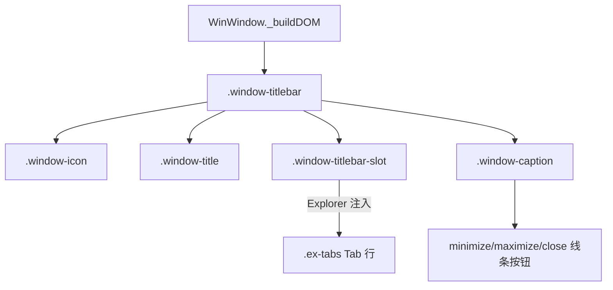

## 用户需求

将 WindowsNext 模拟桌面项目中的窗口 UI 统一更新为与截图 `Z:\explorer.jpg` 一致的亚克力半透明窗户风格，并针对 Explorer 文件管理器做专项标题栏改造。

## 产品概述

- 所有应用窗口统一为亚克力（Acrylic）半透明毛玻璃外观，圆角更大、边框更轻、背景透出桌面壁纸渐变。
- 窗口标题栏右侧的最小化、最大化、关闭控制按钮更新为截图中简洁的线条图标风格（细线、无填充、hover 浅灰底）。
- Explorer 文件管理器的多标签页（Tab）从独立标签页栏移入窗口顶端标题栏区域，与窗口图标/标题并排，并在右侧提供新建标签（+）入口，形成 Windows 11 风格的一体化标题栏。

## 核心特性

- 全局窗口亚克力半透明样式统一（含 normal/snapped 态毛玻璃、maximized 态不透明规则保持）。
- 控制按钮改为极简线条图标（minimize 横线、maximize 方框、close 叉号），统一 hover/active 反馈。
- Explorer 标题栏内嵌 Tab 行：图标 + 当前标签标题 + 关闭按钮 + 新建标签按钮；标签切换、关闭、新建交互保持原有逻辑。
- 标题栏高度随内嵌 Tab 适当增高，拖拽/双击最大化/系统菜单等既有行为不受影响。

## 技术栈

- 沿用现有项目：原生 ES Module + 原生 DOM + Shadow DOM + CSS 变量驱动（无框架）。
- 样式层：`src/styles/window.css`（窗口外观）、`src/styles/variables.css`（设计令牌）、`src/apps/explorer/explorer.css`（应用样式）。
- 逻辑层：`src/core/window.js`（窗口 DOM 与事件）、`src/apps/explorer/index.js`（标签页逻辑）、`src/ui/icons.js`（图标）。

## 实现方案

### 总体策略

在不破坏现有 Aero 规则一（普通态毛玻璃 / 最大化态不透明）的前提下，调整窗口外观令牌与标题栏/控制按钮样式，使之贴近截图亚克力观感；并通过 window.js 暴露「标题栏可注入插槽」机制，让 Explorer 将 Tab 行挂载到标题栏中，从而把 Tab 从 `.ex-main` 内移到标题栏。

### 关键技术决策

1. **亚克力观感调整（variables.css）**

- 提高 `--aero-opacity` 至约 0.55、增大 `--radius-lg` 至 12px、`--aero-window-border` 提亮（如 `rgba(255,255,255,0.5)`），并在 window.css 给 normal/snapped 态加更明显的内发光高光，逼近截图的淡紫/粉渐变透出效果。
- 保持 maximized 态 `backdrop-filter:none` 与不透明底色（Aero 规则一不变），避免回归。

2. **控制按钮线条化（window.css + icons.js）**

- 在 `src/ui/icons.js` 新增/确认 `minimize`、`maximize`、`restore`、`close` 的极简线条 SVG（1px 描边、currentColor）。
- window.css 将 `.caption-btn` 统一为透明底、细线图标；hover 使用 `var(--bg-hover)`，close hover 使用截图风格深红 `#C42B1C`。按钮宽度适度收窄（如 40px）以贴近简洁感。

3. **标题栏 Tab 插槽（window.js）**

- 在 `_buildDOM()` 的 `.window-titlebar` 内、`icon` 与 `caption` 之间插入一个 `<div class="window-titlebar-slot">`（flex:1，min-width:0，overflow:hidden），作为应用可注入区域。
- 新增 `WinWindow` 方法 `setTitlebarSlot(node)` / `getTitlebarSlot()`，将传入节点 append 到该插槽；Explorer 在 mount 时调用，把原本 `.ex-tabs` 容器移入插槽。
- 提供 `ctx` 中可用的 `ctx.window.setTitlebarSlot(...)`（需确认 ctx.window 已暴露当前 WinWindow 实例；现有 `ctx.window.isActive` 已存在，说明 ctx.window 即实例）。

4. **Explorer Tab 迁移（explorer/index.js + explorer.css）**

- 将 `.ex-tabs` 从 `.ex-main` HTML 模板移除，改为在 JS 中创建并 `ctx.window.setTitlebarSlot(tabsEl)`。
- `.ex-tabs` 样式改为适配标题栏：高度填充标题栏、横向滚动、标签间距紧凑、新建按钮（`+`）常驻末尾。
- 标题栏高度变量 `--titlebar-height` 增至约 44px（含 Tab 行），并在 window.css 让 `.window-titlebar` 与插槽垂直居中。
- 原有 `renderTabs`/`syncPaneVisibility`/`closeTab` 逻辑不变，仅 DOM 挂载位置变化。

### 性能与可靠性

- 仅新增 CSS 变量与插槽节点，不引入额外重排；Tab 渲染逻辑复用，避免重复重建。
- 拖拽/缩放/双击最大化事件绑定在 `.window-titlebar` 上，插槽内元素通过 `e.target.closest('.caption-btn')` 与 Tab 点击的 `stopPropagation` 隔离，不影响窗口拖拽（现有 `_onTitlebarPointerDown` 已排除 `.caption-btn`，需同时排除 `.window-titlebar-slot` 内的交互元素以避免误拖拽）。

## 实现要点（防回归）

- 保持 `maximized`/`snapped` 态样式规则不被破坏。
- 非 Explorer 应用不使用标题栏插槽，插槽为空时不影响布局（flex 占位 0）。
- 标题栏 Tab 点击需 `stopPropagation`，防止触发窗口拖拽或系统菜单。
- 复用现有 `getIcon` 与图标命名，不新增图标资源文件。

## 架构设计



修改集中在窗口外观令牌、标题栏结构、Tab 挂载点，不影响窗口状态机与 Shadow DOM 内容隔离。

## 目录结构

```
src/
├── styles/
│   ├── variables.css      # [MODIFY] 调整 --aero-opacity/--radius-lg/--aero-window-border/--titlebar-height 等亚克力与尺寸令牌
│   └── window.css         # [MODIFY] 重写 normal/snapped 亚克力高光、.caption-btn 线条风格、.window-titlebar-slot 插槽样式、标题栏高度适配
├── core/
│   └── window.js          # [MODIFY] _buildDOM 增加 .window-titlebar-slot；新增 setTitlebarSlot/getTitlebarSlot；拖拽排除插槽交互元素
├── ui/
│   └── icons.js           # [MODIFY] 确认/补充 minimize/maximize/restore/close 极简线条 SVG（currentColor, 1px stroke）
└── apps/
    └── explorer/
        ├── index.js       # [MODIFY] 将 .ex-tabs 移出 .ex-main 模板，改为创建后注入 ctx.window.setTitlebarSlot(tabsEl)
        └── explorer.css   # [MODIFY] 调整 .ex-tabs 为标题栏内嵌样式（高度填充、紧凑、含 + 按钮），移除独立标签栏底部边框等
```

## 关键代码结构

```js
// window.js 新增方法（接口级）
/** 将自定义节点注入标题栏中间插槽（如 Explorer 的 Tab 行） */
setTitlebarSlot(node) {
  if (!node) return;
  this.titlebarSlotEl.replaceChildren(node);
}
/** 返回标题栏插槽容器，便于应用复用 */
getTitlebarSlot() { return this.titlebarSlotEl; }
```

## 设计风格

采用 Windows 11 Fluent / Acrylic 风格：大圆角（12px）、轻量白色半透明边框、淡紫粉渐变壁纸透出的毛玻璃质感。标题栏为一体化设计，左侧应用图标 + 标题，中部为嵌入的 Tab 标签行（当前标签高亮、含关闭×与新建+），右侧为极简线条控制按钮（最小化横线、最大化方框、关闭叉号，hover 浅灰底、关闭红色）。

## 页面/组件块设计

- 窗口外框：圆角 12px，亚克力半透明（backdrop-filter blur+saturate），内发光高光描边，悬浮投影。
- 标题栏（高度约 44px）：左图标+标题，中 Tab 插槽（横向滚动、紧凑标签），右控制按钮组（3 个 40px 宽按钮，细线图标）。
- 控制按钮：透明底，currentColor 线条图标；minimize/maximize hover 浅灰，close hover 深红 #C42B1C。
- Explorer Tab：标签含文件夹图标+标题+×；末尾常驻 + 新建；激活标签背景略实、底部无边框，与标题栏融合。

## 可用扩展

### SubAgent

- **code-explorer**
- 用途：在生成详细实现前，跨文件确认 `ctx.window` 实例是否已暴露 `setTitlebarSlot` 所需接口，以及 icons.js 中现有图标命名是否覆盖 minimize/maximize/restore/close。
- 预期结果：明确 ctx.window 引用与图标现状，避免计划中的接口假设错误。