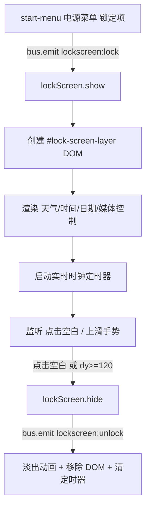

## 用户需求

为 windows 桌面模拟项目新增锁屏界面，复刻参考截图样式并接入现有开始菜单触发链路。

## 产品概述

在现有 Windows Next 桌面环境中新增一层全屏锁屏界面。用户通过开始菜单电源按钮中的「锁定」项触发锁屏；锁屏界面覆盖任务栏、窗口与桌面图标，展示当前壁纸背景、天气、大号时间与日期、媒体控制胶囊；用户可点击空白处或按住鼠标左键向上滑动来解锁回到桌面。本锁屏为无密码展示型，不验证身份。

## 核心功能

- 开始菜单「锁定」按钮触发锁屏（替换原有不支持提示）
- 锁屏层覆盖全屏，遮挡下方所有桌面内容，背景复用当前壁纸
- 实时显示时间（HH:mm）与本地化日期（如 2026年8月14日 星期五）
- 展示模拟天气信息（多云 28°）及对应图标
- 底部媒体控制胶囊：Windows 徽标 + 上一首/播放(暂停)/下一首，点击播放按钮切换播放/暂停图标
- 解锁方式一：鼠标点击锁屏界面空白处
- 解锁方式二：按住鼠标左键向上滑动超过 120px 阈值解锁，未达阈值松手回弹
- 解锁后锁屏淡出并恢复桌面交互，不影响壁纸播放

## 技术栈

- 沿用项目现有栈：原生 ES Modules（type="module"）、HTML + CSS 变量体系、Fluent/Aero 设计令牌
- 新增模块遵循现有 shell 模块模式（class + 单例 export，通过 bus 事件总线通信）
- 样式新增独立 CSS 文件，沿用 variables.css 设计令牌，保持 shell.css 不膨胀

## 实现方案

### 总体策略

新建 `src/shell/lock-screen.js` 锁屏模块，采用与 start-menu.js / wallpaper.js 一致的单例类模式。在 `index.html` 新增 `#lock-screen-layer` 全屏容器（置于 #shell-layer 之后、#overlay-layer 之前），通过 CSS 高 z-index 覆盖下方内容。开始菜单电源菜单「锁定」项改为 `bus.emit('lockscreen:lock')`，锁屏模块订阅该事件并调用 show()。

### 关键技术决策

1. **图层位置**：`#lock-screen-layer` 放在 `#shell-layer` 与 `#overlay-layer` 之间，z-index 设为高于任务栏（--z-taskbar:8000）/窗口层（--z-window-top:5000），但低于启动遮罩（--z-boot:9900）与对话框（--z-dialog:9000）。新增 `--z-lockscreen: 9500`，确保覆盖所有桌面与 Shell 内容，解锁时层移除后壁纸层不受影响。
2. **背景复用壁纸**：锁屏层使用半透明深色蒙版 + `backdrop-filter` 模糊，叠加在壁纸之上，不复制壁纸元素，避免视频壁纸双实例与额外解码开销。
3. **解锁交互**：

- 点击解锁：监听锁屏层 `pointerdown`，若 `e.target` 为锁屏根容器或其空白区域（非媒体胶囊按钮）即触发解锁。媒体控制按钮 `stopPropagation` 避免误触发。
- 上滑解锁：在锁屏层监听 `pointerdown` 记录起点，`pointermove` 计算垂直位移 `dy`，实时用 `transform: translateY()` 让内容跟随上移并降低蒙版透明度；`pointerup` 时若 `dy >= 120` 则播放退出动画解锁，否则回弹归位。整个手势通过 `pointercapture` 保证拖拽连续。

4. **实时时钟**：复用项目 `toLocaleTimeString` / `toLocaleDateString` 本地化方案，定时器对齐到下一分钟边界（与 taskbar `_startClock` 一致），避免每秒重绘。
5. **媒体控制占位**：仅可视化，播放/暂停按钮切换 `play`/`pause` 图标，`prev`/`next` 仅视觉反馈（无真实播放器）；点击不触发解锁（stopPropagation）。
6. **天气静态数据**：锁屏内渲染固定模拟数据「多云 28°」+ 新增 weather 图标，不接入网络。

### 性能与可靠性

- 锁屏层仅在锁屏时创建/显示 DOM，解锁即移除，无常驻开销；时钟定时器在 hide 时清除。
- 上滑手势使用 `requestAnimationFrame` 合帧更新 transform，避免布局抖动。
- 复用现有 `createLogger`、`getIcon`、`bus`、设计令牌，不引入新依赖。
- 向后兼容：`boot.js` 中锁屏模块初始化置于所有 Shell 模块之后，加入 `disposables`；解锁事件 `lockscreen:unlock` 供后续扩展。

## 实现注意事项

- 锁屏触发前先关闭开始菜单（`bus.emit('shell:close-popups')` 或直接 close），避免菜单浮于锁屏之上。
- 锁屏显示时设置 `body` 标记（如 `data-locked="true"`）便于全局样式与输入拦截（如屏蔽开始菜单 Win 键触发）。
- 解锁动画结束后再移除 DOM 并清除定时器，释放监听，防止内存泄漏。
- 在 `index.html` 的 `<head>` 引入新 CSS，在 `</body>` 前插入 `#lock-screen-layer`。

## 架构设计



## 目录结构

```
g:/WindowsNext/
├── index.html                          # [MODIFY] head 引入 lock-screen.css；body 新增 #lock-screen-layer 容器（位于 #shell-layer 与 #overlay-layer 之间）
├── src/
│   ├── boot.js                         # [MODIFY] 导入并初始化 lockScreen，加入 disposables（在 desktop.init 之后、installGlobalHandlers 之前）
│   ├── shell/
│   │   ├── lock-screen.js              # [NEW] 锁屏模块：LockScreen 类，show()/hide()，渲染天气/时钟/媒体控制，点击与上滑解锁交互，bus 事件订阅
│   │   └── start-menu.js               # [MODIFY] 电源菜单「锁定」项 onClick 改为 bus.emit('lockscreen:lock')，移除 toast 提示
│   ├── ui/
│   │   └── icons.js                    # [MODIFY] GLYPHS 新增 weather（多云）图标
│   └── styles/
│       └── lock-screen.css             # [NEW] 锁屏层全屏样式、信息居中布局、媒体胶囊、上滑/淡出动画、--z-lockscreen 层级
```

## 设计风格

复刻 Windows 11 锁屏视觉：当前壁纸作为背景，叠加半透明深色模糊蒙版。界面内容垂直居中偏下，采用 Fluent 设计语言，白色文字带柔和阴影保证在任意壁纸上可读。

## 页面布局（单屏：锁屏界面）

- 顶部状态区（屏幕上方约 8% 处，贴近右上或居中）：静态模拟天气胶囊，显示天气图标 + 「多云 28°」，半透明圆角胶囊，毛玻璃质感。
- 中央主信息区（垂直居中）：超大号时间（如 12:00，font-size 约 88px，细字重 300），下方中号日期（如 2026年8月14日 星期五，font-size 约 20px），文字白色带 text-shadow。
- 底部媒体控制胶囊（靠近底部，距底约 12%）：居中圆角胶囊，左侧 Windows 徽标，右侧三个圆形媒体按钮（上一首 / 播放或暂停 / 下一首），半透明白底毛玻璃，悬停微亮。
- 解锁提示：底部中央小字提示「点击任意处或上滑解锁」（淡入淡出微动画）。

## 交互与动效

- 进入：锁屏层淡入（opacity 0→1，约 200ms）。
- 上滑：内容随手指上移，蒙版透明度同步降低（translateY + opacity 联动，rAF 驱动）。
- 解锁：内容整体上滑淡出（约 240ms ease-decel），随后移除。
- 回弹：未达阈值松手，内容回弹归位（transform 过渡 200ms）。
- 媒体按钮：悬停背景提亮，点击播放/暂停切换图标（play ↔ pause）。

## 字体与颜色

- 字体：Noto Sans SC（与项目一致），时间字重 300，日期字重 400，天气/媒体 400。
- 主文字色：#FFFFFF，带 text-shadow 0 2px 8px rgba(0,0,0,.5)。
- 蒙版：rgba(0,0,0,.35) + backdrop-filter blur(20px)。
- 胶囊底色：rgba(255,255,255,.14)，边框 rgba(255,255,255,.22)，毛玻璃 blur(20px)。
- 媒体按钮底色：rgba(255,255,255,.10)，悬停 rgba(255,255,255,.22)。