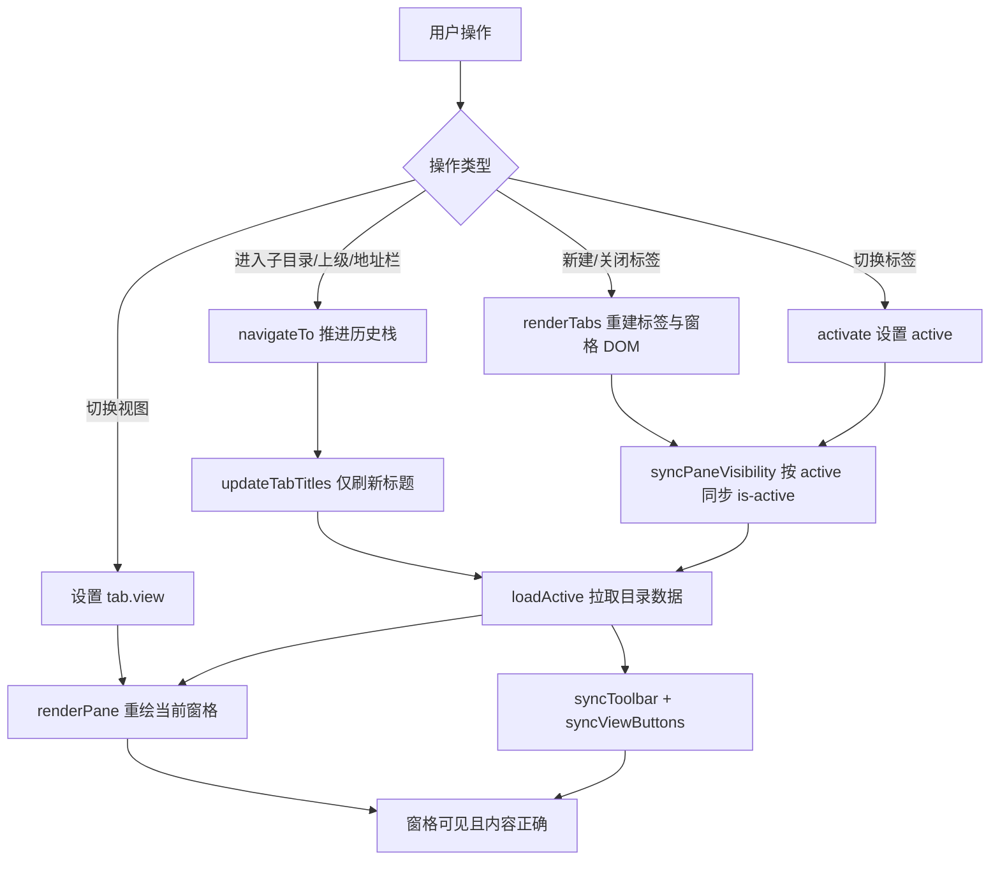

## 用户需求

修复 `src/apps/explorer` 文件资源管理器应用中导致其无法正常使用的两个阻断性缺陷：

1. **视图切换失效**：在「大图标 / 列表 / 详细信息」三种视图间切换后，当前文件夹的内容无法正常显示。
2. **进入子文件夹后内容空白**：双击文件夹进入子目录后，即使该目录确实存在大量文件，文件列表也不显示。

要求审查 `src/apps/explorer` 目录下的代码并进行修复。

## 产品概述

文件资源管理器是该 Web 版 Windows 桌面模拟系统中的核心应用，提供多标签页浏览、左侧快速访问与驱动器导航、地址栏路径输入、目录搜索，以及新建 / 重命名 / 删除 / 复制粘贴等文件操作能力。本次工作聚焦于恢复其基础可用性，不改变既有产品形态与交互定位。

## 核心功能（修复后应达到的效果）

- **目录浏览稳定可见**：双击文件夹进入子目录、点击「上级」、地址栏回车跳转、前进 / 后退等所有导航路径，都能立即在可见区域正确渲染目标目录的完整内容。
- **三视图自由切换**：大图标、列表、详细信息三种视图可任意切换，切换后内容始终正常展示；视图偏好按标签页独立保存，切换标签页时工具栏的视图高亮状态与该标签页实际视图保持一致。
- **详细信息视图列对齐**：表头（名称 / 修改日期 / 类型 / 大小）与数据行的列位置精确对齐；「详细信息」按钮使用与「列表」按钮相区分的独立图标。
- **多标签页状态正确**：新建、切换、关闭标签页时窗格显隐与标签高亮始终同步；关闭最后一个标签页后自动回到主目录且不出现状态错乱。
- **文件操作可用**：重命名可正常提交并在非法名称时给出可读的中文原因提示；新建文件 / 文件夹后原地进入重命名状态，而不会误跳转进入该文件夹或用关联应用打开它。
- **地址栏输入顺畅**：手动输入路径过程中内容不会被自动清空或回填。
- **目录刷新精准**：外部文件变更事件仅在变更确实发生于当前目录范围内时才触发刷新，避免同名前缀目录的误刷新。

## 技术栈

沿用项目现有技术形态，不引入任何新依赖：

- **语言与模块**：原生 ES Modules（`type="module"`），纯 JavaScript，无构建步骤、无框架
- **UI**：原生 DOM API + CSS 变量主题（`var(--bg-surface)` / `var(--accent)` 等）
- **应用契约**：应用以 `export default async function mount(ctx)` 形式挂载，通过 `ctx.fs` / `ctx.notify` / `ctx.dialog` / `ctx.events` / `ctx.openPath` / `ctx.launchApp` / `ctx.injectStyleSheet` 与内核交互
- **依赖模块（只读，不修改）**：`src/core/fs/path-utils.js`、`src/core/fs/fs-service.js`、`src/ui/icons.js`、`src/shell/context-menu.js`

## 问题根因（已通过读码逐条确认）

### 根因 A —— 窗格 `is-active` 丢失（同时导致问题 1 与问题 2，最关键）

`explorer.css` 中窗格默认不可见，仅靠 `is-active` 显示：

```css
.ex-pane { position: absolute; inset: 0; display: none; ... }  /* L145-151 */
.ex-pane.is-active { display: block; }                          /* L152 */
```

而 `index.js` 的 `renderTabs()`（L144-176）会 `panesEl.innerHTML = ''` 清空并重建全部窗格，新建窗格只有 `ex-pane` 类，**不带 `is-active`**：

```js
const pane = document.createElement('div');
pane.className = 'ex-pane';   // L167：缺少 is-active
```

全文中 `is-active` **仅在 `activate()`（L121）** 被赋予。因此所有「调用 `renderTabs()` 但不调用 `activate()`」的路径都会让当前窗格永久隐藏：

- `activateEntry()`（L347-359）双击进入子目录：`renderTabs()` → `loadActive()`，**从不调用 `activate()`** → 直接对应用户问题 2；
- `.ex-up` 上级按钮（L386-394）：同样模式；
- 地址栏回车（L397-409）：同样模式。

`loadActive()` 确实把条目渲染进了 DOM，但整个窗格 `display:none`，故表现为「子文件夹里明明有文件却什么都不显示」。

### 根因 B —— 视图切换（问题 1）

视图按钮处理器（L427-435）本身逻辑成立，但一旦经历过根因 A，当前窗格已隐藏，`renderPane()` 重绘后依然不可见，用户感知即「切换视图后内容消失」。此外视图高亮是全局的，`activate()` / `syncToolbar()` 均未按 `active.view` 重新同步 `[data-view]` 按钮，多标签下视图状态与高亮错位。

### 根因 C —— 详细信息表头错列

`renderEntry()` 详细信息分支产出 5 个子元素（`.ex-entry-icon` + `.col-name` + `.col-date` + `.col-type` + `.col-size`），匹配 CSS 的 5 列网格 `24px minmax(160px,1fr) 140px 100px 90px`（L207）；但 `headerRow()`（L311-316）只产出 4 个 `.col-*`，缺少首列图标占位，导致表头整体左移一列。

### 其他已确认缺陷（同一文件，一并修复）

| # | 位置 | 问题 |
| --- | --- | --- |
| 1 | `beginRename()` L653-654 | `P.validateName()` 返回 `{ok, reason}` 对象，对象恒为真值，导致**任何重命名都被拦截**并弹出 `[object Object]`。应判断 `.ok`、提示 `.reason` |
| 2 | `createNew()` L588 | `el.dispatchEvent(new MouseEvent('dblclick'))` 会触发 `activateEntry`：新建文件夹立即跳入、新建文件被关联应用打开，后续 `beginRename` 找不到元素。应删除此行 |
| 3 | `closeTab()` L128-142 | 关闭最后一个标签时先 `openInNewTab(home)`（内部已 push + renderTabs + activate），紧接着 `tabs.shift()` 移除刚建的标签，导致 `tabs` 为空而 `active` 指向已移除对象 |
| 4 | `fs:changed` L505-507 | `payload.path.startsWith(currentPath())` 前缀过宽，查看 `C:/Foo` 时 `C:/Foo2` 的变更也会刷新。项目已有 `P.isSubPath()` 应改用 |
| 5 | 地址栏 L410-415 | `input` 事件 1.2s 后无条件把输入框回填为 `currentPath()`，手输稍慢即被清空 |
| 6 | 工具栏 L66 | 「详细信息」按钮误用 `getIcon('list', 16)`，与「列表」按钮完全相同；`src/ui/icons.js` L61 已有专用 `details` 图标 |
| 7 | `rangeSelect()` L330-339 | 用 `pane.querySelector('.is-selected')` 取锚点，实际得到文档序首个选中项而非真实 shift 锚点 |


## 实现方案

### 核心策略：单一可信来源 + 增量更新，杜绝「重建即失效」

问题的本质是**「DOM 重建」与「激活态赋予」被拆分在两个函数中，且调用方可以只调其一**。修复采用两条互补措施，从结构上根除该类缺陷，而非逐个打补丁：

1. **抽取 `syncPaneVisibility()` 作为唯一的显隐真值同步点**，并在 `renderTabs()` 末尾**无条件调用**。这样无论何种路径重建 DOM，窗格显隐都必定基于 `active` 重新计算，不再依赖调用方记得配合调用 `activate()`。

2. **抽取统一的 `navigateTo(path)` 导航原语**，收敛「进入子目录 / 上级 / 地址栏跳转」三处重复的历史栈操作（三处均为 `history.slice(0, cursor+1)` + `push` + `cursor++` + `renderTabs()` + `loadActive()` 的复制粘贴）。同时把「重建整棵标签 DOM」降级为**只更新标题**（`updateTabTitles()`）——导航时标签集合并未变化，无需重建窗格。

第 2 点同时带来明确的性能收益：导航不再销毁重建全部窗格 DOM，避免了非活动标签页内容被无谓丢弃（原实现下切回其他标签必然触发一次多余的 `readDir` 重新拉取）。

### 关键技术决策

- **不重写文件、不引入虚拟 DOM 或状态库**：缺陷是局部的显隐同步与调用契约问题，采用针对性小改动即可根除，符合项目「原生 DOM、零依赖」的既有风格，避免技术债。
- **`renderTabs()` 与 `updateTabTitles()` 职责分离**：前者仅在标签集合发生增删时调用（`openInNewTab` / `closeTab`），后者用于导航时的轻量标题刷新。这是 SoC 的直接应用，也消除了「导航必重建 DOM」的性能浪费。
- **视图状态按标签页存续**：`tab.view` 已存在于 `newTab()` 模型中，只需补充 `syncViewButtons()` 并在 `activate()` / `syncToolbar()` 中调用，即可让 UI 反映真实状态，无需扩展数据模型。
- **`renderPane()` 保持渲染到 `.ex-list` 的现有结构**：CSS 的 `.ex-view-details .ex-entry` 等选择器均以视图类为祖先选择器，现有 DOM 层级（pane > .ex-list.ex-view-* > .ex-entry）与之匹配，不做结构调整以控制影响面。

### 性能与可靠性说明

- 目录条目渲染为 O(n) 的 DOM 构建，`fs.readDir` 与 `fs.search`（`limit: 200`）本身有上限保护，当前规模下无需虚拟滚动；本次修复不增加任何额外遍历。
- 渲染条目时使用 `DocumentFragment` 批量插入，避免逐条 `appendChild` 触发的多次重排（现有实现逐条插入，大目录下有可感知卡顿）。
- `activate()` 内部调用了未 await 的 `loadActive()`，而 `openInNewTab` 又 `await activate(tab)`；将 `activate` 改为 `async` 并 `await loadActive()`，消除竞态导致的状态错乱。
- 保持向后兼容：不改动 `ctx` 契约、不改动 `src/core/fs/` 任何文件、不改动 CSS 类名语义（仅补充表头占位列）。

## 架构设计

修复后 Explorer 内部的状态流转：



关键点：`syncPaneVisibility()` 成为窗格显隐的唯一出口，任何重建 DOM 的路径都必经此处，从结构上避免「重建后忘记激活」。

## 目录结构

本次修复仅涉及 Explorer 应用自身的两个文件，不触碰内核与其他应用。

```
g:/WindowsNext/
└── src/
    └── apps/
        └── explorer/
            ├── index.js      # [MODIFY] 主逻辑修复
            └── explorer.css  # [MODIFY] 详细信息视图表头列对齐微调
```

### `src/apps/explorer/index.js` [MODIFY]

**职责**：Explorer 应用全部逻辑（标签页模型、导航、渲染、文件操作、右键菜单、快捷键、拖放）。

**需实现的改动**：

1. **新增 `syncPaneVisibility()`**：遍历 `tabs`，按 `t === active` 对窗格与标签元素 `classList.toggle('is-active', on)`。在 `renderTabs()` 末尾无条件调用，`activate()` 改为复用它。
2. **新增 `updateTabTitles()`**：仅更新 `.ext-title` 文本，供导航时替代 `renderTabs()`。
3. **新增 `navigateTo(path, opts)`**：统一执行 `history = history.slice(0, cursor+1)` → `push(path)` → `cursor++` → 清空搜索态（可选）→ `updateTabTitles()` → `await loadActive()`。用它替换 `activateEntry()`（L347-359）、`.ex-up`（L386-394）、地址栏回车（L397-409）三处重复逻辑。
4. **新增 `syncViewButtons()`**：按 `active.view` 同步 `[data-view]` 按钮的 `is-active`；在 `syncToolbar()` 中调用，保证切换标签页时高亮正确。
5. **`activate()` 改为 `async` 并 `await loadActive()`**，消除竞态。
6. **修复 `headerRow()`（L311-316）**：在四个 `.col-*` 前补一个空的图标占位 `<span class="ex-entry-icon"></span>`，与数据行的 5 列结构对齐。
7. **修复 `closeTab()`（L128-142）**：关闭最后一个标签时直接走 `openInNewTab(SHELL_FOLDERS.home)` 并**移除 `tabs.shift()`**；调整 `renderTabs()` 调用位置避免重复重建。
8. **修复 `beginRename()`（L653-654）**：改为 `const v = P.validateName(next); if (!v.ok) return ctx.notify.error(v.reason);`。
9. **修复 `createNew()`（L588）**：删除 `el.dispatchEvent(new MouseEvent('dblclick'))`，仅保留选中 + `beginRename`。
10. **修复 `fs:changed`（L505-507）**：改用 `P.isSubPath(currentPath(), payload.path)` 判定。
11. **移除地址栏 `input` 防抖回填（L410-415）**，改为在 `blur` 时回填 `currentPath()`（若用户未提交）。
12. **详细信息按钮图标（L66）**：`getIcon('list', 16)` → `getIcon('details', 16)`。
13. **`rangeSelect()`（L330-339）**：引入模块内 `selectionAnchor` 变量，在 `selectOnly` / 普通点击时记录锚点，shift 选择时以其为起点。
14. **`renderPane()` 使用 `DocumentFragment`** 批量插入条目，减少重排。

### `src/apps/explorer/explorer.css` [MODIFY]

**职责**：Explorer 全部样式。

**需实现的改动**：仅针对详细信息视图表头做对齐微调——`.ex-view-details .ex-header` 补充首列（图标占位列）的样式约定，确保补充占位 `<span class="ex-entry-icon">` 后表头与数据行网格严格对齐；保持 `position: sticky` 吸顶效果不变。其余样式不动。

## 验证要点

1. 双击进入任意多层子目录，内容立即可见且条目数与状态栏一致。
2. 在子目录中依次切换大图标 / 列表 / 详细信息，三种视图均正确渲染，详细信息表头与数据列对齐。
3. 开多个标签页并设置不同视图，来回切换标签，视图按钮高亮与实际视图一致。
4. 前进 / 后退 / 上级 / 地址栏回车四种导航均正常显示内容。
5. 重命名文件成功；输入含 `\ / : * ? " < > |` 的名称时提示中文原因。
6. 新建文件夹后原地进入重命名，不发生跳转。
7. 关闭最后一个标签页后自动回到主目录，可继续正常操作。

## Agent Extensions

### SubAgent

- **code-explorer**
- Purpose: 在动手修改前，快速核验 `renderTabs` / `activate` / `loadActive` / `renderPane` 的全部调用点，以及 `is-active` 在 Explorer 内的所有读写位置，确认没有遗漏的「重建 DOM 但未同步显隐」路径。
- Expected outcome: 输出完整的调用链清单与受影响行号，确保 `syncPaneVisibility()` / `navigateTo()` 的抽取覆盖所有导航入口，不遗留隐性缺陷。