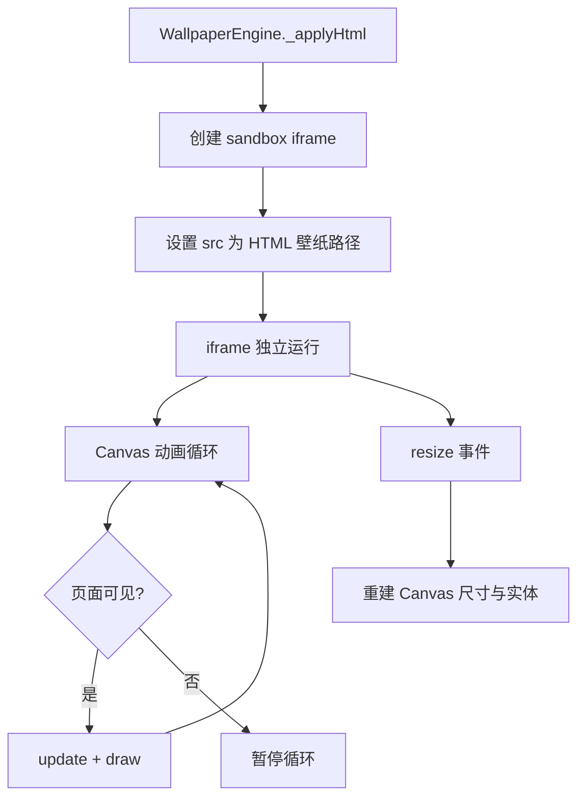

## 产品概述

为 Windows 11 桌面模拟 Web 应用新增 7 个基于 HTML 的高质量动态壁纸文件，与现有 `particles.html` 一同存放于 `assets/html-wallpapers/` 目录，丰富桌面背景的选择。

## 核心功能

每个壁纸均为独立单文件 HTML（内联 CSS + JS，无外部依赖），包含以下必备能力：

- 自主动态动画（Canvas 驱动，`requestAnimationFrame` 循环）
- 视口自适应（响应 `resize` 事件）
- 省电与性能优化（`visibilitychange` 暂停/恢复，DPR 上限为 2，粒子/元素数量根据屏幕面积自适应）
- 暗色/氛围型背景配色，与桌面图标形成良好对比

## 7 个壁纸主题

1. **starry-sky.html** — 星空银河：闪烁星星 + 流星划过 + 星云渐变光晕
2. **aurora.html** — 极光帷幕：多层流动极光带，Perlin 噪声驱动的色彩渐变波动
3. **matrix-rain.html** — 数字雨：Matrix 风格绿色字符下落，带亮度头部和拖尾淡出
4. **ocean-waves.html** — 海洋波浪：多层正弦波浪叠加，带泡沫粒子
5. **geometric-flow.html** — 几何流动：旋转的三角形/六边形网络，线条流动光效
6. **bubbles.html** — 浮动气泡：半透明气泡上升，带彩虹反射和大小变化
7. **fireflies.html** — 萤火虫森林：暗绿背景中的发光萤火虫，带呼吸光晕和随机飘动

## 技术栈

- 纯前端：HTML + 内联 CSS + 原生 JavaScript（Canvas 2D API）
- 无任何外部依赖（无 CDN、无 npm 包）

## 实现方案

### 整体策略

参考现有 `particles.html` 的技术模式和代码结构，每个壁纸文件遵循统一的最佳实践模板：

1. **文件结构**：`<div>` 背景层 + `<canvas>` 动画层
2. **初始化流程**：获取 Canvas 上下文 → 设置 DPR → 创建动画实体 → 启动循环
3. **动画循环**：`requestAnimationFrame` 驱动，先更新实体状态再绘制
4. **生命周期**：`resize` 重建尺寸与实体，`visibilitychange` 暂停/恢复循环
5. **性能边界**：DPR 上限 2，实体数量根据 `(W*H)/N` 公式自适应，含上限保护

### 性能设计

- Canvas 尺寸按 `min(devicePixelRatio, 2)` 缩放，避免高分屏像素填充瓶颈
- 动态实体数量随屏幕面积线性增长但设置硬上限
- 页面不可见时完全停止 `requestAnimationFrame`，恢复后重新计时避免时间跳跃
- 使用 `ctx.globalAlpha` 批量设置透明度而非每帧反复计算

### 代码复用模式

提取 `particles.html` 中的通用模式作为各壁纸的基础骨架：

- DPR 计算与 Canvas 尺寸设置
- `resize` 与 `visibilitychange` 事件处理
- 帧率控制与时间步长计算（用于速度归一化）

### 架构设计

每个壁纸是独立的自治单元，与桌面引擎零耦合。iframe 的 `sandbox="allow-scripts"` 和 `pointerEvents: none` 确保了壁纸无法访问父页面，同时鼠标事件穿透到桌面图标。壁纸演进为纯观赏性的自主动画，不依赖用户交互。



### 目录结构

```
assets/html-wallpapers/
├── particles.html        # [已存在] 粒子网络壁纸
├── starry-sky.html       # [NEW] 星空银河壁纸：闪烁星星、流星、星云光晕
├── aurora.html           # [NEW] 极光帷幕壁纸：多层极光带、色彩渐变波动
├── matrix-rain.html      # [NEW] 数字雨壁纸：Matrix 风格绿色字符下落
├── ocean-waves.html      # [NEW] 海洋波浪壁纸：多层正弦波浪叠加、泡沫粒子
├── geometric-flow.html   # [NEW] 几何流动壁纸：旋转多边形网络、线条光效
├── bubbles.html          # [NEW] 浮动气泡壁纸：半透明气泡上升、彩虹反射
└── fireflies.html        # [NEW] 萤火虫森林壁纸：暗绿背景、发光萤火虫飘动
```

### 关键实现要点

#### starry-sky.html

- 200-400 颗星星，每颗有独立闪烁相位和周期（使用 `sin(time + seed)` 控制亮度）
- 随机出现流星（每 2-5 秒一颗），带渐隐尾巴
- 多层径向渐变叠加模拟星云光晕

#### aurora.html

- 使用简化的正弦波叠加模拟 Perlin 噪声驱动的极光帷幕
- 3-4 层不同频率/振幅/速度/色相的极光带（绿色到紫色渐变）
- 每条极光带由数十个控制点连接成贝塞尔曲线路径，填充半透明渐变

#### matrix-rain.html

- 字符列数 = `ceil(width / fontSize)`，每列独立速度和起始偏移
- 每列字符从顶部落下，头部为亮白色/亮绿色，主体渐变至暗绿色
- 字符随机切换（片假名 + 数字 + 字母组合）

#### ocean-waves.html

- 4-5 层不同深浅蓝色的正弦波叠加，每层频率和速度不同
- 波形用 `quadraticCurveTo` 绘制，填充半透明渐变以表现深度
- 白色泡沫粒子散布在波峰附近

#### geometric-flow.html

- 由正三角形拼接成的网格（类似低多边形风格），三角形沿网格法线方向微量位移
- 线条沿网格边旋转流动（带发光效果 `shadowBlur`）
- 网格整体缓慢旋转，色彩在 HSL 空间中缓慢漂移

#### bubbles.html

- 60-100 个气泡，从底部生成上升到顶部后重新生成
- 气泡大小随机（5-25px 半径），带径向渐变模拟玻璃反射
- 轻微水平漂移（正弦扰动）

#### fireflies.html

- 40-80 只萤火虫，每只有独立的闪烁相位、飘动速度、活动半径
- 使用径向渐变绘制多层光晕（内层亮白，中层黄绿，外层透明）
- 背景为深绿色调，叠加暗角效果模拟森林暗处