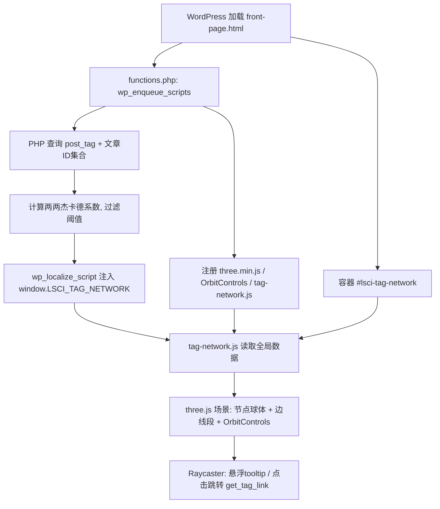

## 用户需求

将当前 Twenty Twenty-Two 区块主题改造为生命科学科技风格，核心是新增网站主页并三维可视化标签关联网络。

## 产品概述

在主题中新增 `front-page.html` 作为站点首页。首页通过 three.js 将博客所有 `post_tag` 按文章重叠度（杰卡德系数）构建的三维关联网络进行可视化，浏览者可用鼠标旋转/缩放查看，悬浮节点显示标签描述，点击节点跳转标签文章列表页。整体视觉为浅色洁净科研风。

## 核心功能

- 新增 `front-page.html` 区块主题首页模板，含挂载三维网络的容器与浅色科技风标题/说明区块。
- 在 `functions.php` 中查询所有 `post_tag`，计算两两标签文章集合的杰卡德系数，过滤低权重边，组装节点与边数据为 JSON 并以内联方式注入前端脚本。
- 本地引入 three.js 与 OrbitControls，注册自定义可视化脚本。
- three.js 中以球体绘制标签节点（颜色按生命科技绿/蓝绿，大小按文章数），以半透明连线绘制高于阈值的边。
- 鼠标拖动旋转、滚轮缩放浏览三维网络（OrbitControls）。
- 悬浮节点通过 Raycaster 检测，显示对应 `post_tag` 的 description 文本浮层。
- 点击节点跳转该标签归档页（如 `/tag/{slug}/`，由 `get_tag_link` 生成）。

## 技术栈

- 主题类型：WordPress 6.5 区块主题（Block Theme），模板为 `templates/*.html`，配置在 `theme.json`，逻辑在 `functions.php`。
- 三维库：three.js（本地 UMD 构建）+ OrbitControls（本地 UMD 构建），置于 `assets/js/vendor/`。
- 前端脚本：原生 JavaScript（ES5 兼容写法），通过 `wp_enqueue_script` 注册，依赖 three.js。
- 数据注入：PHP `get_terms('post_tag')` + `get_posts` + `wp_localize_script` 内联 JSON 到 `window.LSCI_TAG_NETWORK`。

## 实现方案

### 总体策略

区块主题模板为纯 HTML，无法内嵌 PHP，因此所有数据计算与脚本注册必须在 `functions.php` 完成，模板仅提供挂载容器 `#lsci-tag-network`。PHP 在 `wp_enqueue_scripts` 阶段计算标签网络并 `wp_localize_script` 注入，前端 `tag-network.js` 读取全局变量构建 three.js 场景。

### 关键技术决策

1. **本地 UMD 版 three.js**：选择 three.js 的 UMD 构建（`build/three.min.js`）及对应的非模块版 OrbitControls，以便 `wp_enqueue_script` 直接按依赖顺序注册，避免 ES module / import map 复杂性。理由：区块主题无打包构建流程，UMD 最省事且稳定。
2. **内联 JSON 而非 REST**：用户已选 `functions.php` 注入内联 JSON，页面生成时数据即固定，前端零异步请求，首屏即可渲染。用 `wp_localize_script` 注入全局变量。
3. **杰卡德系数边阈值**：PHP 端计算 `J = |A∩B| / |A∪B|`，仅保留 `J ≥ 0.1` 的边（阈值定义为常量便于调整），降低连线密度与前端绘制量。
4. **节点布局**：前端用确定性球面/螺旋分布或简单三维力导向迭代（轻量、固定步数）为节点分配坐标，避免后端耦合坐标。节点大小映射文章数 `count`，颜色在绿(#2e9e5b)/蓝绿(#1b9e9e)间按度数或名称哈希分配。
5. **交互**：`Raycaster` 做节点拾取；`mousemove` 更新 HTML tooltip 浮层显示 description；`click` 触发 `window.location.href = node.link`。

### 性能与可靠性

- 标签数量通常为几十到几百，两两组合数为 O(n²)，对博客规模可忽略；`get_posts` 按标签查询建议用 `fields => 'ids'` 仅取 ID，避免加载文章正文，降低内存与查询开销。
- 边绘制用 `THREE.LineSegments` 一次性批量绘制（而非逐条 Line），减少 draw call。
- 节点用 `InstancedMesh` 或合并球体几何体可选；数量不大时直接用独立 `Mesh` 亦可接受，优先保证可读性。
- `animate` 循环仅在需要时重绘（OrbitControls 启用了 `enableDamping` 需持续渲染），用 `requestAnimationFrame`。

## 实现注意事项

- 复用现有 `functions.php` 的 `twentytwentytwo_styles()` 同文件新增 `twentytwentytwo_front_page_scripts()` 并挂 `wp_enqueue_scripts`，注意仅在 `is_front_page()` 时加载 three.js 与可视化脚本，控制影响范围（blast radius）。
- `get_tag_link($term_id)` 生成跳转 URL，兼容站点固定链接设置，不硬编码路径。
- tooltip 浮层用绝对定位 `div`，避免覆盖 Canvas 事件；`pointer-events: none` 防止干扰拾取。
- 浅色背景在 `front-page.html` 用内联样式或主题 group/cover 块设定，不改动 `theme.json` 全局配色以免波及其他模板。

## 架构设计



## 目录结构

```
twentytwentytwo/
├── functions.php                      # [MODIFY] 新增前端脚本注册钩子；新增标签网络数据计算与 wp_localize_script 注入逻辑；仅 is_front_page() 加载。
├── templates/
│   └── front-page.html                # [NEW] 区块主题首页模板。含浅色科技风标题/说明区块与全宽容器 #lsci-tag-network（HTML 块），用于挂载 three.js 画布。
└── assets/
    └── js/
        ├── vendor/
        │   ├── three.min.js           # [NEW] 本地 three.js UMD 构建。
        │   └── OrbitControls.js       # [NEW] 本地 OrbitControls UMD 构建（匹配 three 版本）。
        └── tag-network.js             # [NEW] 前端可视化脚本。读取 window.LSCI_TAG_NETWORK，构建 three.js 场景、节点、边、OrbitControls、Raycaster 交互与 tooltip。
```

## 设计风格

采用浅色洁净科研风（Light Clean Scientific）。整体以白/浅灰白为背景，营造实验室与科研论文配图的清爽质感。主页顶部为生命科学科技风格的标题区（如站点名 + 副标题“标签关联网络 / Tag Co-occurrence Network”），下方为占据主要视口的三维网络画布。

## 页面区块设计（front-page.html）

1. **顶部标题块**：浅色背景上居中显示站点标题（大号无衬线字体）与一行说明文字，体现生命科学科技感，下方细分割线。
2. **网络画布块**：全宽容器 `#lsci-tag-network`，高度约 70-80vh，承载 three.js 渲染的浅色三维标签网络；背景为极浅灰白渐变。
3. **悬浮提示块**：HTML tooltip 浮层（绝对定位、半透明白底、圆角、轻微阴影），显示标签名与 description，指针 `none` 不挡交互。
4. **底部说明块**：一行小字说明“拖动旋转 · 滚轮缩放 · 点击标签查看文章”，置于画布下方，浅灰文字。

## 交互与动效

- 节点球体带轻微自发光/高光，悬浮时高亮放大并弹出 description。
- OrbitControls 阻尼旋转，滚轮平滑缩放，整体流畅无卡顿。
- 连线为半透明绿/蓝绿色，权重越高越不透明越粗（视觉用颜色深浅区分）。